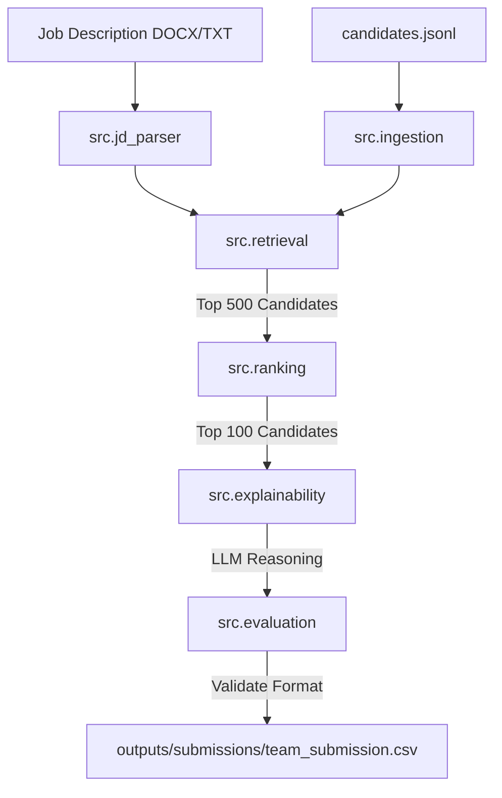

# System Architecture

This document describes the high-level architecture of the **Intelligent Candidate Discovery & Ranking Challenge** system.

## System Overview

The system is designed as a modular pipeline to process a large pool of candidates (100,000+ candidates) and identify the top 100 best-fit candidates for a given Job Description (JD). The pipeline operates within strict compute constraints (CPU-only, 16 GB RAM, 5-minute execution limit, no network access during ranking).

## Architectural Components

1. **Ingestion & Preprocessing (`src.ingestion`, `src.preprocessing`)**:
   - Parses the candidate pool JSONL file.
   - Cleans text fields and formats structured features (e.g. experience years, skills).
   - Generates/loads cached candidate representations.

2. **Job Description Parser (`src.jd_parser`)**:
   - Extracts semantic skills, mandatory qualifications, experience thresholds, and preferences from the target JD.

3. **Hybrid Retrieval (`src.retrieval`)**:
   - Performs a fast filtering pass using TF-IDF/BM25 and semantic embedding match.
   - Reduces the candidate pool from 100,000 to the top 500 potential matches.

4. **Multi-Criteria Ranking (`src.ranking`)**:
   - Computes weighted scores across several dimensions (skills, experience, education, cultural fit).
   - Filters out trap candidates and honeypots using redrob signals.

5. **Explainability (`src.explainability`)**:
   - Uses local or API-driven LLMs to write clear, 1-2 sentence justification reasoning for each of the top 100 candidates.

6. **Evaluation & Validator (`src.evaluation`, `validate_submission.py`)**:
   - Evaluates system performance internally.
   - Ensures the output CSV complies with format rules.
